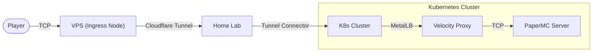

ファイル：`Docs/0.System/0.Sys_Deployment.md`
更新日時：`2025/12/30 01:05`

# 本番環境デプロイメント定義

本ドキュメントでは、Minecraftプロジェクトの本番環境（Production Environment）におけるインフラストラクチャ構成、デプロイメント戦略、および関連する周辺エコシステムについて定義します。

## 1. インフラストラクチャ概要

本番環境はオンプレミス（Home Lab）のKubernetesクラスター上に構築され、Cloudflareのエッジネットワークを通じて外部に公開されます。

### 技術スタック
| カテゴリ | 技術・ツール | 用途・備考 |
|:---|:---|:---|
| **Compute** | **Kubernetes** (K3s / Talos) | コンテナ・オーケストレーション |
| **GitOps** | **ArgoCD** | マニフェストの自動同期 (Pull型) |
| **Tunneling** | **Cloudflare Tunnel** | 安全なインバウンド接続 (No Port Forwarding) |
| **Network** | **MetalLB** | オンプレミス環境でのLoadBalancer提供 |
| **Proxy** | **Velocity** | Minecraftプロキシサーバー (BungeeCord Fork) |
| **Storage** | **Longhorn** | 分散ブロックストレージ (PVC) |
| **Object Storage** | **Cloudflare R2** | バックアップ、ログ、アセット配信 (S3互換) |

### ネットワークフロー (Ingress)
プレイヤーがサーバーに接続するまでのトラフィックフローは以下の通りです。

1.  **VPS**: パブリックIPを持つエントリーポイント。Cloudflare Tunnelのエッジとして機能します。
2.  **Cloudflare Tunnel**: VPSとHome Lab間を暗号化されたトンネルで接続します。ファイアウォールのポート開放は不要です。
3.  **MetalLB**: クラスタ内でVelocity PodにLoadBalancer IP (VIP) を割り当てます。
4.  **Velocity**: バックエンドのPaperMCサーバーへ接続をルーティングします。

## 2. リソース構成

### コンピュートリソース (Pods)
*   **Minecraft Server**: ステートフルなゲームサーバー。標準のDockerイメージを使用。
*   **Velocity Proxy**: ネットワークの入り口。

### ストレージ戦略
データの永続化とバックアップには、用途に応じて異なるストレージクラスを使用します。

| データ種別 | ストレージ | 詳細 |
|:---|:---|:---|
| **World Data** | **PVC (Longhorn)** | 低レイテンシ・高可用性が求められるメインデータ。 |
| **User Data** | **PVC (Longhorn)** | プレイヤーデータ、統計情報など。 |
| **Backup** | **Cloudflare R2** | 定期バックアップの送付先。容量単価と可用性を重視。 |
| **Logs** | **Cloudflare R2** | 過去ログのアーカイブ。 |
| **Assets** | **Cloudflare R2** | リソースパック等の静的ファイル配信。 |

**Cloudflare R2採用理由:**
*   **Egress Fee Free**: データ取り出し（ダウンロード）にかかる転送量が無料であるため、リソースパック配信やバックアップ復元時のコストリスクがない。
*   **Workers Integration**: 後述のWorkersエコシステムとの連携が容易。

## 3. Cloudflare Workers エコシステム

Cloudflare Workersを活用し、サーバー本体系への負荷をかけずに周辺機能を強化します。

### A. Smart Resource Pack Delivery
常に最新のリソースパックを高速かつ低コストに配信するシステムです。

*   **Domain**: `rp.mc.krz-tech.net`
*   **構成**:
    *   **Registry**: 管理者はR2へリソースパックをアップロード。
    *   **Computation**: Workerがアップロード時にSHA-1ハッシュを自動計算し、Workers KVに `verify-hash` を保存。
    *   **Endpoint**: サーバープラグインは `/api/pack/latest` を叩くことで、計算済みのハッシュとダウンロードURLを取得可能。
    *   **Delivery**: プレイヤーへのzipファイル配信は、WorkerがR2からストリーミングし、エッジキャッシュを効かせて高速化。

### B. Edge Status & Dynamic MOTD
Webサイトやランチャー向けの情報をエッジで生成・配信します。

*   **Domain**: `motd.mc.krz-tech.net`
*   **構成**:
    *   **Cron Trigger**: Workeres Cronが1分ごとにVelocityへPingを送信。
    *   **Caching**: 取得したステータス（人数、MOTD、Ping応答時間）をKVにキャッシュ。
    *   **Remote Config**: メンテナンスモードのON/OFFやカスタムMOTDをKV経由で注入可能。
    *   **Benefit**: Webサイト構築時、Minecraftサーバーへ直接クエリを投げずに済むため、DDoS耐性が向上しサーバー負荷もゼロになる。

## 4. リポジトリ構成と役割

| リポジトリ名 | 役割 | 監視ツール |
|:---|:---|:---|
| `minecraft-project-infra` | K8sマニフェスト、Helmチャート、ArgoCD設定 | ArgoCD |
| `minecraft-project-skript` | ゲームロジック (Skript)、プラグイン設定 | ArgoCD (Sidecar Sync) |

デプロイメント（本番反映）はArgoCDによるGitレポジトリの定期ポーリングによって行われます。
開発フローの詳細は [Docs/0.System/0.Sys_Flow.md](Docs/0.System/0.Sys_Flow.md) を参照してください。
