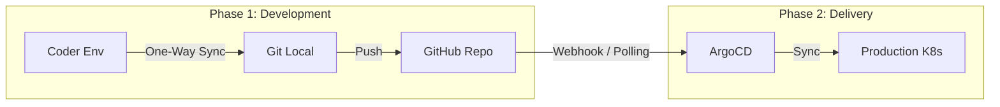

ファイル：`Docs/0.System/0.Sys_Flow.md`
更新日時：`2025/12/30`

# 開発・デプロイメントフロー

本ドキュメントでは、開発環境から本番環境に至るまでのコードと設定の流れ（パイプライン）について記述します。

## 1. 全体パイプライン (CI/CD)



## 2. フェーズ詳細

### Phase 1: Development (開発)
開発は主にCoder上のクラウド開発環境で行われます。

*   **開発環境ガイド**: [`Docs/1.Development/1.Dev_Coder.md`](Docs/1.Development/1.Dev_Coder.md)
*   **コーディング規約**: [`Docs/1.Development/1.Dev_Skript.md`](Docs/1.Development/1.Dev_Skript.md)

**One-Way Sync & Directory Strategy:**
`minecraft-project-skript` リポジトリは以下のディレクトリ構成を持ちます。

```text
minecraft-project-skript/
├── develop/      # 開発中のSkriptファイル
└── production/   # 本番稼働中のSkriptファイル (CI/CD対象)
```

1.  **Dev Sync**: Coder環境からの変更は、まず `develop` ブランチの `develop/` ディレクトリへ同期・Pushされます。
2.  **Pull Request**: 機能実装が完了したら、`develop` ブランチから `production` ブランチへのPull Requestを作成します。この際、ファイルは `production/` ディレクトリへ移動・反映されます（このプロセスはGitHub Actions等のCIで自動化、あるいは手動で行います）。

### Phase 2: Continuous Delivery (継続的デリバリー)
本番環境へのデプロイは、**特定のブランチかつ特定のディレクトリ**への変更のみをトリガーとして厳格に行われます。

1.  **Strict Trigger**: ArgoCDアプリケーションは、以下の条件が**すべて**満たされた場合のみ同期プロセスを開始します。
    *   **Source Repository**: `minecraft-project-skript` / `minecraft-project-infra`
    *   **Target Revision**: `production` ブランチ
    *   **Path**: `production/` ディレクトリ (マニフェストまたはスクリプト)

2.  **Synchronization**: 上記条件を満たすPush（例: `develop` からのPRマージ）が発生すると、ArgoCDは自動的に本番Clusterへ変更を適用します。これにより、開発中のコード（`develop/`）が誤って本番環境にデプロイされる事故を確実に防ぎます。

3.  **Application**:
    *   **Skript**: ConfigMap/Volume更新により、ゲームサーバーへ即座に配布されます。
    *   **Settings**: サーバー設定の変更はPodの再作成を伴う場合があります（Rollover）。

## 3. ロールバック
クリティカルなバグが発生した場合、ArgoCDのWeb UIまたはGitのRevertコミットによって、直前の安定したバージョンへ即座に切り戻すことが可能です。
