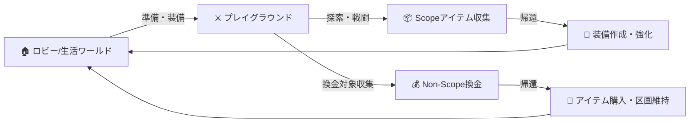

# ゲームシステム概要 (General)

## コンセプト
本サーバーは **「Playground (危険地帯)」** でのリスクある探索と、**「Life World (安全地帯)」** での準備・交流を繰り返す、Extraction RPGサーバーです。

## コアゲームループ

1.  **準備 (Prepare)**: 生活ワールドで装備を整え、食料や弾薬（矢など）を用意する。
2.  **出撃 (Deploy)**: プレイグラウンドへ移動。ランダムな地点にスポーン。
3.  **探索 (Explore)**: 敵(PvE)や他プレイヤー(PvP)を警戒しながら、物資を収集。
4.  **帰還 (Vanish)**: 生きて脱出し、戦利品を持ち帰る。
5.  **成長 (Progression)**: 持ち帰った素材で強力な装備を作り、コインで区画を拡張する。

## ステータスシステム
バニラの体力・空腹度に加え、以下のRPGステータスを導入し、装備依存度を高めます。

| ステータス | 説明 | 上げ方 |
|-----------|------|-------|
| **HP (AP)** | Armor Points. スーツの耐久値。0になると生身になる。 | スーツ性能、強化パーツ |
| **DEF (装甲)** | 実弾・エネルギーダメージの軽減率。 | スーツ性能、強化パーツ |
| **ATK (出力)** | Tech武器の威力倍率。 | スーツ性能、OSチューニング |
| **EN (エネルギー)** | アクションやTech武器で使用するエネルギー総量。 | ジェネレータ性能(Suit依存) |
| **FCS (管制)** | ロックオン距離・速度・精度。 | FCSチップ(Suit依存) |

## 経済システム
通貨単位: **Δ (デルタ)**

*   **インフレ対策**:
    *   プレイグラウンドからの帰還時のみ、Non-Scopeアイテムがシステムにより換金される（システムからの通貨供給）。
    *   プレイヤー間の売買では通貨は移動するだけで増えない。
    *   区画の維持費、ショップでの消耗品購入で通貨を回収（Coin Sink）。

## ランクシステム
プレイヤーの熟練度を示す指標。
*   **ランク**: F 〜 SSS
*   ランクが高いほど、プレイグラウンドでの初期所持品枠が増えたり、生活ワールドで購入できる区画のグレードが上がる。
*   プレイグラウンドで死亡するとランク経験値が減少する（最悪ランクダウン）。
