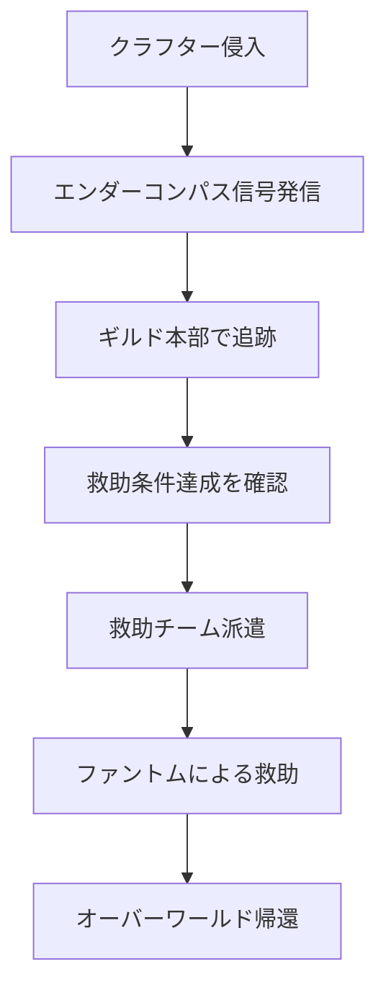

ファイル：`Docs/2.GameSystem/2.Game_Core/DeltaGuild.md`
更新日時：`2026/01/01`

# Delta Guild

本ドキュメントでは、プレイグラウンド探索を支援する組織「Delta Guild」の詳細を定義します。クラフターはこのギルドに所属し、探索活動を行います。

## 1. 概要

### 基本情報

| 項目 | 内容 |
|:---|:---|
| **名称** | Delta Guild（デルタギルド） |
| **本部所在地** | オーバーワールド中心都市（古代都市の直上） |
| **目的** | プレイグラウンド探索の支援・クラフターの育成 |
| **主要資産** | プレイグラウンドポータル、エンダーコンパス技術 |

### 本部の地理

ギルド本部は古代都市の研究開発を目的として、古代都市の直上に建設された。

```
【構造】
地上: ギルド本部（受付、各部門、クラフター施設）
  ↓
地下: 古代都市（ディープダーク）
  └─ プレイグラウンドポータル
```

ギルド本部の設立により周辺に人やモブが集まり、自然発生的にオーバーワールドの中心都市が形成された。

### 設立背景

Delta Guildの起源は、2人の伝説的プレイヤーのうち「スリルを求めた方」に遡る。

彼は平和な世界においても冒険を求め続け、エンドの研究者たちと協力して未知の領域への扉を開く研究を進めていた。この研究と組織が、現在のDelta Guildへと発展した。

伝説のプレイヤーたちが姿を消した後、残された研究成果と組織を引き継いだモブたちによって、ギルドは正式に設立された。エンドとの共同研究により、古代都市の技術を応用したポータルとエンダーコンパスを開発。これらの技術はまだ発展途上だが、クラフターたちのプレイグラウンド探索を可能にしている。

> **謎**: 伝説のプレイヤーたちが消えたタイミングでプレイグラウンドが出現したことから、ギルドの研究と彼らの失踪には何らかの関係があるのではないかと噂されている。

## 2. ポータル技術

### プレイグラウンドポータル

| 項目 | 内容 |
|:---|:---|
| **所有者** | Delta Guild |
| **設置場所** | ギルド本部 |
| **技術基盤** | 古代都市の技術 + エンドとの共同研究 |
| **状態** | 発展途上（不安定） |

### ポータルの特性

* **座標制御不能**: テレポート先はランダム
* **片道**: プレイグラウンド側にポータルは出現しない
* **ギルド専有**: ポータルの使用にはギルド所属が必要

### 技術的経緯

1. 古代都市で発見された次元転移技術の研究開始
2. エンドのエンダーマン研究者との共同開発
3. プレイグラウンドへの侵入に成功
4. 帰還技術（エンダーコンパス）の開発
5. Delta Guild設立、探索事業の開始

## 3. エンダーコンパス

### 概要

エンダーコンパスは、ディメンションをまたいでクラフターの位置を追跡できる改良型コンパスである。

| 項目 | 内容 |
|:---|:---|
| **開発** | Delta Guild + エンドの共同研究 |
| **機能** | ディメンション間位置追跡 |
| **用途** | 救出プランの策定、クラフターの安全確保 |

### 仕組み

* クラフターはプレイグラウンド侵入時にエンダーコンパスを携帯
* ギルド本部でコンパスの信号を受信・追跡
* 救助チームはこの情報を元に救出プランを立案
* ファントム等の救助要員がクラフターの位置を特定し救助

### 救助システムフロー



## 4. 組織構成

### 部門一覧

| 部門 | 担当モブ | 役割 |
|:---|:---|:---|
| **受付・依頼管理** | ヴィンディケーター | クラフターの登録、依頼受付、任務管理 |
| **物資・流通** | 村人 | アイテムの流通、装備の供給、買取 |
| **医療** | ウィッチ | 回復ポーション提供、帰還後のケア |
| **偵察・斥候** | エンダーマン、エンダーマイト | プレイグラウンドの情報収集、経路調査 |
| **救助** | ファントム | クラフターの救助、帰還支援 |

### 各部門の詳細

#### 受付・依頼管理部（ヴィンディケーター）

* クラフターの新規登録手続き
* 探索依頼の受付・管理
* ランク認定・昇格手続き
* 報酬の精算

> **設定補足**: ヴィンディケーターはThe Peaceful Update以前は襲撃者だったが、現在はその統率力と事務処理能力を活かしてギルド運営を担当。

#### 物資・流通部（村人）

* 探索に必要な装備・消耗品の販売
* プレイグラウンドで獲得したアイテムの買取
* Δコインによる取引の管理
* 在庫管理・価格設定

#### 医療部（ウィッチ）

* 回復ポーション・治療薬の調合
* 帰還後のクラフターの健康管理
* 緊急時の医療対応
* 探索用ポーションの開発

#### 偵察・斥候部（エンダーマン、エンダーマイト）

* プレイグラウンドの地形・敵配置の調査
* 安全な経路の発見・報告
* 危険エリアの警告
* テレポート技術を活かした情報収集

> **設定補足**: エンドからの派遣要員。エンドとの技術協力の一環として、偵察任務を担当。

#### 救助部（ファントム）

* エンダーコンパスを元にクラフターを捜索
* 救助条件達成後、クラフターを回収
* オーバーワールドへの帰還支援
* 空からの広域捜索

> **設定補足**: ファントムはギルドに所属する救助専門チーム。飛行能力を活かし、プレイグラウンドの上空からクラフターを発見・救助する。

## 5. クラフター登録

### 登録フロー

1. ギルド本部の受付（ヴィンディケーター）で登録申請
2. 基本情報の登録、エンダーコンパスの支給
3. 適性検査（初回プレイグラウンド探索）
4. 救助完了をもって正式登録完了
5. 銅ランクからスタート

### 適性検査（チュートリアル）

| 項目 | 内容 |
|:---|:---|
| **目的** | クラフターの適性確認、基本操作の習得 |
| **内容** | 初回プレイグラウンド侵入〜救助完了 |
| **合格条件** | 生存して帰還（死亡しても再挑戦可能） |
| **報酬** | 正式ギルドメンバー登録、初期装備 |

### 適性検査の流れ

1. ギルド本部でエンダーコンパスを受け取る
2. ポータルからプレイグラウンドへ侵入
3. 探索しながら救助条件（時間経過 or 移動距離）を満たす
4. ファントムの救助を受けて帰還
5. 受付で正式登録完了

## 6. ランクシステム

### 概要

ギルドメンバーの練度はランクによって可視化される。ランクはMinecraftの鉱物に基づく。

| ランク | 鉱物 | 備考 |
|:---|:---|:---|
| **Copper** | 銅 | 初期ランク |
| **Iron** | 鉄 | |
| **Gold** | 金 | |
| **Diamond** | ダイヤモンド | |
| **Netherite** | ネザライト | 最高ランク |

### ランク経験値

* プレイグラウンド探索で経験値を獲得
* 一定の経験値でランクアップ
* 死亡時は経験値の一部をロスト
* 詳細な数値は別途定義

## 7. 参照ドキュメント

* [WorldView.md](./WorldView.md) - 世界観設定
* [MobSociety.md](./MobSociety.md) - モブ社会
* [Playground.md](../2.Game_Battle/Playground.md) - プレイグラウンド詳細
* [Currency.md](../2.Game_Economy/Currency.md) - 通貨システム
