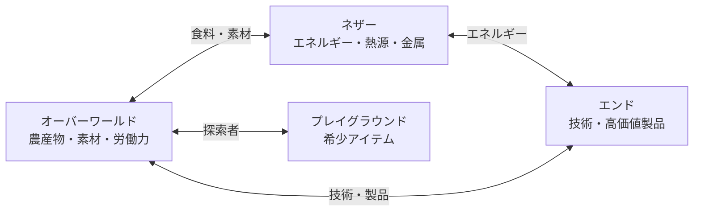
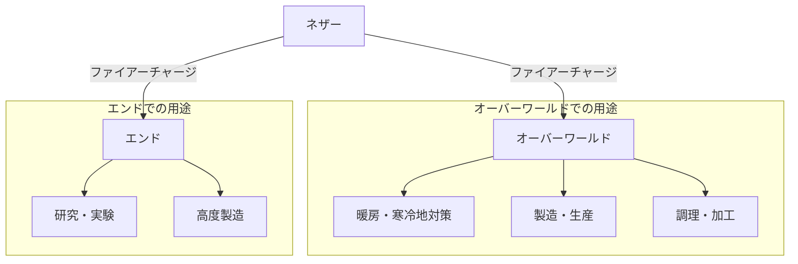

ファイル：`Docs/2.GameSystem/2.Game_Core/MobSociety.md`
更新日時：`2026/01/01`

# モブ社会

本ドキュメントでは、The Peaceful Update後の各ディメンションにおけるモブの社会構造・役割・文化を定義します。

## 1. 概要

### 基本原則

* 全てのモブは友好化し、社会の一員として生活している
* 元敵対モブも差別なく社会に参画し、普通に会話する
* モブの「能力」は固有のものではなく、**技術力**によって成り立っている
    * 例：クリーパーは自爆するのではなく、TNT等の道具を使用する
    * 例：スケルトンの弓術は訓練と技術の結果である

### モブとプレイヤーの関係

モブたちは「プレイヤー」を不思議と認識している。

* プレイヤーが「プレイヤー」であることを、モブたちは本能的に理解している
* これはMinecraftという世界の一部として、遺伝子的に組み込まれている認識
* モブたちにとって、プレイヤーは「世界のパーツの1つ」として自然に受け入れられる存在
* 伝説のプレイヤーも、新参者のクラフターも、同じ「プレイヤー」として認識される

> **メタ設定**: この世界がMinecraftであること、そしてプレイヤーという存在が特別であることを、モブたちは説明できないが「知っている」。

### ディメンション間関係

* 各ディメンションは現実世界の「国」に相当する独立した存在
* 基本的にはフェアな貿易・外交関係を維持
* 各ディメンション固有の資源・技術を相互に供給し合う経済圏

## 2. オーバーワールド

### 概要

| 項目 | 内容 |
|:---|:---|
| **役割** | 生活の中心地、クラフターの拠点 |
| **統治** | プレイヤー・村人中心の社会 |
| **特徴** | 多様なモブが共存する多文化社会 |

### 社会構造

オーバーワールドは明確な統治機関を持たず、村人とプレイヤー（クラフター）が中心となって社会を形成している。各地域・村ごとに自治が行われ、緩やかな連合体として機能する。

### 主要モブと役割

| モブ | 役割 | 備考 |
|:---|:---|:---|
| **村人** | 商業・生産・農業の中心 | 各職業（農民、司書、武器鍛冶等）で経済を支える |
| **鉄のゴーレム** | 治安維持・警備 | 穏やかだが頼れる存在。村の守護者 |
| **ファントム** | プレイグラウンド救助担当 | 空を飛ぶ能力を活かし、救助任務を遂行 |
| **ゾンビ** | 肉体労働・夜間作業 | 疲れ知らずの体質を活かした労働力 |
| **スケルトン** | 射撃・精密作業 | 弓術の技術を活かした職業。狩猟、警備など |
| **クリーパー** | 採掘・解体業 | TNT等の爆発物を扱う専門家集団 |
| **クモ** | 建設・高所作業 | 壁を登る技術を活かした建築業 |
| **ウィッチ** | 薬学・医療 | ポーション技術を活かした医療従事者 |
| **スライム** | 素材供給 | スライムボール等の素材を提供 |

### 文化・特徴

* 昼夜を問わず活動できる社会（元敵対モブの夜間活動能力）
* 多様な種族が共存することで、様々な技術・文化が融合
* クラフターを歓迎し、プレイグラウンド探索を支援する風土

## 3. ネザー

### 概要

| 項目 | 内容 |
|:---|:---|
| **役割** | 全ディメンションのインフラ・エネルギー供給 |
| **統治** | ウィザー（三権分立の法的機関） |
| **特徴** | 資源・エネルギーの供給拠点 |

### 社会構造

ネザーはウィザーを頂点とする統治機関によって管理されている。ウィザーの3つの頭はそれぞれ異なる権力を担い、三権分立の体制を形成している。

> **設定補足**: 本作のウィザーはネザーに元から存在する存在である。バニラMinecraftのように召喚して生成されるボスではなく、ネザーの創世から存在する古代の統治者として設定されている。

#### ウィザーの三権分立

| 頭 | 担当 | 役割 |
|:---|:---|:---|
| **中央の頭** | 行政 | エネルギー政策・資源管理の執行 |
| **左の頭** | 立法 | 貿易規則・労働法規の制定 |
| **右の頭** | 司法 | 紛争解決・法の執行 |

### 主要モブと役割

| モブ | 役割 | 備考 |
|:---|:---|:---|
| **ウィザー** | 統治機関 | ネザーに元から存在する。三権分立で統治 |
| **ウィザースケルトン** | 行政官・官僚 | ウィザーの補佐、各部門の管理 |
| **ピグリン** | 貿易商・商人 | 金への関心が高く、ディメンション間貿易を担う |
| **ブレイズ** | エネルギー供給 | 溶岩からファイアーチャージを生成できる唯一の存在 |
| **ガスト** | 大型輸送・空輸 | 巨体を活かした貨物輸送 |
| **ストライダー** | 溶岩上交通 | 溶岩の海を渡る交通手段。タクシー・物流 |
| **マグマキューブ** | 溶岩関連作業 | 溶岩の管理・整備に従事 |
| **ホグリン** | 畜産・食料供給 | ネザーにおける食料源 |
| **ゾンビピグリン** | 一般労働者 | 様々な産業で活躍 |

### エネルギーシステム

ネザーは全ディメンションのエネルギー供給を担っている。その核となるのが**ブレイズ**と**ファイアーチャージ**である。

#### ブレイズロッド

| 項目 | 内容 |
|:---|:---|
| **定義** | 溶岩→熱エネルギー→ファイアーチャージへ変換する特殊物質 |
| **生成** | ブレイズのみが生成可能 |
| **用途** | ファイアーチャージの製造に必須 |

#### ファイアーチャージ

| 項目 | 内容 |
|:---|:---|
| **定義** | 固形化された熱エネルギー |
| **特性** | 使用することで莫大なエネルギーを解放 |
| **用途** | 暖房、製造、調理、動力など多岐にわたる |

#### エネルギー経済

* **電気の概念は存在しない**—代わりにファイアーチャージが動力源
* オーバーワールド、エンド等全ディメンションに輸出
* 寒冷地（雪原、氷河バイオーム等）では必須アイテム
* アイテムの効率的な製造に欠かせないエネルギー源
* ブレイズはこのエネルギー経済の要であり、ネザーの最重要産業

### 主要拠点

ネザーには2種類の要塞が存在し、それぞれ異なる役割を担っている。

#### ネザー要塞（Nether Fortress）

| 項目 | 内容 |
|:---|:---|
| **役割** | 治安維持組織本部・行政機関 |
| **構成員** | ウィザー、ウィザースケルトン、スケルトン |
| **機能** | 法執行、秩序維持、行政業務 |

* ウィザーの三権分立を実務レベルで執行する機関
* ネザー全土の治安を管理
* ウィザースケルトンが官僚・行政官として各部門を統括
* スケルトンは現場の治安維持部隊として活動

#### ピグリン要塞（Bastion Remnant）

| 項目 | 内容 |
|:---|:---|
| **役割** | 商人の拠点・貿易企業 |
| **構成員** | ピグリン、ホグリン |
| **立場** | 中立（政治から独立） |

* 各ピグリン要塞は独立した「企業」として機能
* 要塞ごとに異なる商材・得意分野を持つ
* ディメンション間貿易の実務を担当
* 政治的には中立を保ち、純粋に商業活動に従事

#### 要塞間の関係

```
【ネザーの権力構造】

ウィザー（三権分立の統治機関）
    │
    ├── ネザー要塞（行政・治安）
    │     └─ 法と秩序の執行
    │
    └── ピグリン要塞（商業・貿易）※中立
          └─ 経済活動の担い手
```

* ネザー要塞は国家機関、ピグリン要塞は民間企業に近い
* ウィザーはピグリン要塞の経済活動に過度に干渉しない
* 両者の協力関係がネザー経済を支えている

### 文化・特徴

* 効率と生産性を重視する実利的な社会
* 金を基準とした経済観念が根強い（ピグリンの影響）
* エネルギー供給を全ディメンションに担う責任感と誇り
* 行政（ネザー要塞）と商業（ピグリン要塞）の分離

### 辺境の不穏な動き

> **イベント候補**: ネザーの辺境地域には、現体制に不満を持つ集団が存在するという噂がある。彼らはウィザーの統治に反発し、独自の勢力を築こうとしているとも言われる。詳細は不明。

## 4. エンド

### 概要

| 項目 | 内容 |
|:---|:---|
| **役割** | 高度技術・科学研究・高価値物品生産 |
| **統治** | エンダードラゴン（法的機関） |
| **特徴** | テレポート技術等の先端技術の発祥地 |

### 社会構造

エンドはエンダードラゴンを最高権威とする技術立国。科学研究と技術開発を国是とし、全ディメンションの技術発展に貢献している。エンダードラゴンは象徴的な存在であると同時に、重要な技術政策の最終決定者でもある。

### 主要モブと役割

| モブ | 役割 | 備考 |
|:---|:---|:---|
| **エンダードラゴン** | 統治者・最高知性 | エンドの象徴。技術政策の最終決定者 |
| **エンダーマン** | 技術者・研究者 | テレポート技術の開発者。科学研究の中核 |
| **シュルカー** | 物流・保管専門家 | シュルカーボックス技術の提供者。高度な保管システム |

### 主要拠点

エンドは地理的に「中心島」と「外縁部」に分かれ、それぞれ異なる役割を担っている。

#### 中心島（The End Central Island）

| 項目 | 内容 |
|:---|:---|
| **役割** | エンダードラゴンの本拠地・最高研究機関 |
| **アクセス** | 高度な権限を持つ人員のみ |
| **施設** | メイン研究施設、統治機関本部 |

* エンドの政治・研究の中枢
* 最先端かつ機密性の高い研究が行われる
* 一般のエンダーマンでも立ち入りには許可が必要
* エンダードラゴンが直接統括

#### 外縁部・エンドシティ（End Cities）

| 項目 | 内容 |
|:---|:---|
| **役割** | 産業エリア・製造拠点 |
| **アクセス** | 一般開放（貿易・産業従事者） |
| **施設** | 各種製造工場、物流拠点、シュルカー倉庫 |

* エンダー技術を使用した産業が稼働
* 各エンドシティが特定の製造分野に特化
* 貿易相手や他ディメンションからの訪問者も受け入れ

### エンド産業

エンドは全ディメンションの高度製造を担う産業拠点である。

#### 主要製造品

| 製品 | 技術 | 特徴 |
|:---|:---|:---|
| **エンドクリスタル** | エンダー技術 | 高エネルギー結晶。様々な用途 |
| **高速量産品** | レッドストーン + レーザー加工 | 大量生産・高精度加工 |
| **高価値アイテム** | 古代都市技術 + エンダー技術 | 希少・高性能な製品 |
| **エリトラ** | エンダー技術 | 飛行装備。高価値 |
| **シュルカーボックス** | シュルカー技術 | 高度保管システム |

#### レッドストーン技術

| 項目 | 内容 |
|:---|:---|
| **用途** | 自動化、レーザー加工、精密制御 |
| **エネルギー源** | ファイアーチャージ（ネザーから輸入） |
| **特徴** | 高速・大量・高精度の製造を実現 |

* レッドストーン回路による自動化・精密制御
* レーザー加工技術で高速・大量のアイテム製造
* **ファイアーチャージがなければ稼働しない**—ネザーへの依存

```
【エンドの産業構造】

ネザー ──ファイアーチャージ──→ エンド産業
                                    │
                ┌───────────────────┼───────────────────┐
                ↓                   ↓                   ↓
        エンドクリスタル    レッドストーン工場    高価値製品
                              （レーザー加工）    （古代都市技術）
                                    │
                                    ↓
                            全ディメンションへ輸出
```

### 文化・特徴

* 知識と技術を最も重視する学術的な社会
* テレポート技術、エンダーチェスト等の先端技術を開発
* 高価値な製品（エリトラ等）の生産拠点
* 中心島は閉鎖的、外縁部は貿易に積極的
* ネザーのエネルギー供給に依存（ファイアーチャージ必須）

### 辺境の不穏な動き

> **イベント候補**: エンドの離島には、禁忌とされる技術を研究する集団が潜んでいるという噂がある。彼らは「古代都市の技術」や「プレイグラウンド」に強い関心を持っているとされる。詳細は不明。

## 5. 共通インフラ技術

ポータル技術を応用した通信・保管システムが全ディメンションに普及している。

### ポータル通信網

| 項目 | 内容 |
|:---|:---|
| **技術基盤** | ポータル技術（古代都市 + エンドの共同研究） |
| **普及範囲** | 全ディメンション |
| **用途** | 通信、データ転送、遠隔アクセス |

* 古代都市技術とエンダー技術の融合により実現
* ディメンションを超えた即時通信が可能
* 世界全体のインフラとして機能

### 仮想インベントリシステム

| 項目 | 内容 |
|:---|:---|
| **技術基盤** | ポータル通信網 + エンダーチェスト技術 |
| **機能** | アイテムの大量収集・収納 |
| **利用者** | 全プレイヤー（クラフター） |

* プレイヤーが大量のアイテムを収集・収納できるのはこの技術のおかげ
* 物理的な制限を超えた保管が可能
* ポータル技術により「別空間」にアイテムを保管
* どこからでもアクセス可能

> **メタ設定**: ゲーム上の「大容量インベントリ」は、世界観上ではポータル技術による仮想空間への保管として説明される。

### インフラ依存関係

```
【技術スタック】

古代都市技術 ─┬─→ ポータル技術
              │
エンダー技術 ─┘
              ↓
        ポータル通信網
              │
    ┌─────────┼─────────┐
    ↓         ↓         ↓
 通信設備  仮想インベントリ  その他応用
```

## 6. ディメンション間経済

### 貿易関係



### 各ディメンションの主要輸出品

| ディメンション | 主要輸出品 |
|:---|:---|
| **オーバーワールド** | 農産物、木材、各種素材、労働力 |
| **ネザー** | ファイアーチャージ（エネルギー）、ブレイズロッド、金、ネザライト |
| **エンド** | 先端技術製品、エンダーパール、エリトラ、シュルカーボックス |

### エネルギー依存関係



* 全ディメンションがネザーのエネルギー供給に依存
* 電気の代替としてファイアーチャージが世界経済の基盤
* エネルギー価格はネザーの政策に左右される

### 通貨

* 全ディメンション共通通貨：**Δコイン（デルタコイン）**
* 詳細は [Currency.md](../2.Game_Economy/Currency.md) を参照

## 7. 参照ドキュメント

* [WorldView.md](./WorldView.md) - 世界観設定
* [Playground.md](../2.Game_Battle/Playground.md) - プレイグラウンド詳細
* [Currency.md](../2.Game_Economy/Currency.md) - 通貨システム
