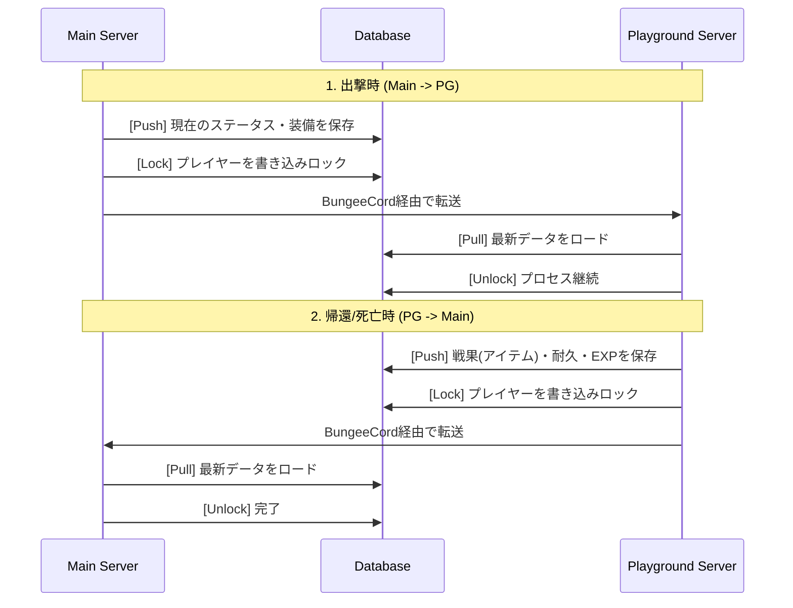

# サーバー間データ同期仕様 (Player Data Synchronization)

## 1. 概要 (Overview)
本プロジェクトは、**Mainサーバー (生活/ロビー)** と **Playgroundサーバー (戦闘)** の2つに分かれています。
プレイヤーのステータス、装備、所持金をリアルタイムかつ安全に同期するための「中央集権型データ管理 (Centralized State)」を構築します。

---

## 2. 同期モデル: Pull-Push アーキテクチャ

サーバー間でデータを直接送受信するのではなく、常に **データベース (PostgreSQL)** を介して同期を行います。

---

## 3. データベース・スキーマ設計 (Conceptual)

### `kp_player_stats` (基本ステータス)
| カラム名 | 型 | 説明 |
|---------|---|------|
| `uuid` | VARCHAR(36) | プライマキー |
| `rank` | VARCHAR(10) | 現在のランク |
| `exp` | BIGINT | ランク経験値 |
| `coins` | DOUBLE | Δコイン |
| `last_server` | VARCHAR(20) | 最後にいたサーバー名 |
| `is_locked` | BOOLEAN | 保存中フラグ (1 = ロック中) |

### `kp_player_inventory` (装備・NBT)
アイテムはSkriptのシリアライズ機能 (`Value of ...`) を使い、**BASE64文字列** または **JSON** としてCLOB型で保存します。

| カラム名 | 型 | 説明 |
|---------|---|------|
| `uuid` | VARCHAR(36) | 外部キー |
| `suit_data` | TEXT | Tech SuitのNBTデータ |
| `weapon_main` | TEXT | メイン武器のNBTデータ |
| `weapon_sub` | TEXT | サブ武器のNBTデータ |
| `accessories` | TEXT | アクセサリ(List)のシリアライズデータ |

---

## 4. Skript による実装ロジック

### 4.1 SQL 接続 (skript-reflect or SkQuery)
アドオンを使用して 非同期 (Async) でクエリを実行し、サーバーのメインスレッドを止めないようにします。

### 4.2 保存タイミング (Push)
*   **サーバー切断時 (`on quit`)**: 強制保存。
*   **PG出撃/帰還コマンド実行時**: 転送直前に保存。
*   **定期保存 (`every 5 minutes`)**: クラッシュ対策。

### 4.3 読み込みタイミング (Pull)
*   **サーバー参加時 (`on join`)**: 
    1. `is_locked` をチェック。ロック中なら数秒待機（前サーバーの保存待ち）。
    2. データをSQLで取得し、`{-kp::%player's uuid%::*}` 変数に展開。
    3. アイトをデシリアライズしてインベントリに復元。

---

## 5. NBT・アイテムの取り扱い

Minecraftのアイテム（特にカスタムモデルや耐久値を持つもの）は単純なID保存では不十分です。

1.  **シリアライズ**: `set {_s} to full nbt of tool` (SkBee使用)
2.  **文字列化**: NBTを文字列としてDBへ保存。
3.  **復元**: 保存された文字列からNBTを再構築し、アイテムを生成。

---

## 6. 排他制御 (Race Condition 対策)

サーバー間の転送は非常に高速なため、**「保存が終わる前に次のサーバーで読み込んでしまう」** 事故を防ぐ必要があります。

- **状態ロック**: 保存開始時にDBの `is_locked` を `true` にし、完了後に `false` に戻す。
- **読み込み待機**: `on join` 時に `is_locked` が `true` の場合、プレイヤーをフリーズさせ、解除されるまで（最大3秒程度）ループ待機させる。
- **タイムアウト**: 3秒経っても解除されない場合は「データエラー」としてキックし、不整合を防ぐ。

---

## 7. 将来的な拡張: Redis の導入
将来的には、より高速なステータス同期（例えばチャットやパーティ情報のリアルタイム共有）のために、Redisを導入し、DBと併用することを検討します。

---

*最終更新: 2025-12-23*
