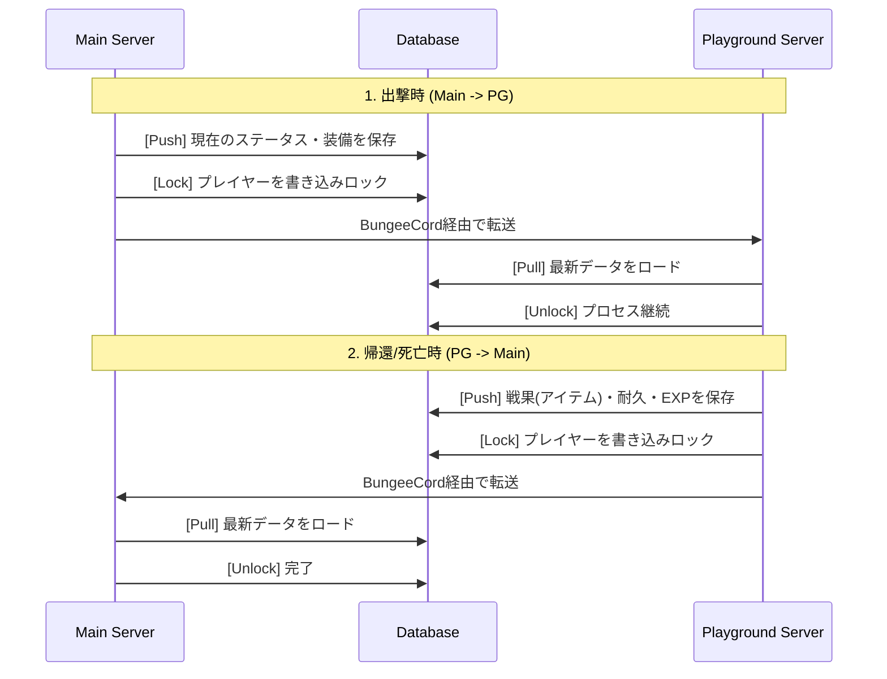

# サーバー間データ同期仕様 (Player Data Synchronization)

## 1. 概要 (Overview)
本プロジェクトは、**Mainサーバー (生活/ロビー)** と **Playgroundサーバー (戦闘)** の2つに分かれています。
プレイヤーのステータス、装備、所持金をリアルタイムかつ安全に同期するための「中央集権型データ管理 (Centralized State)」を構築します。

---

## 2. 同期モデル: Pull-Push アーキテクチャ

サーバー間でデータを直接送受信するのではなく、常に **データベース (PostgreSQL)** を介して同期を行います。



---

## 3. データベース・スキーマ設計 (Conceptual)

### `kp_player_stats` (基本ステータス)
| カラム名 | 型 | 説明 |
|---------|---|------|
| `uuid` | VARCHAR(36) | プライマキー |
| `rank` | VARCHAR(10) | 現在のランク |
| `exp` | BIGINT | ランク経験値 |
| `coins` | DOUBLE | Δコイン |
| `last_server` | VARCHAR(20) | 最後にいたサーバー名 |
| `is_locked` | BOOLEAN | 保存中フラグ (1 = ロック中) |

### `kp_player_inventory` (装備・NBT)
アイテムはSkriptのシリアライズ機能 (`Value of ...`) を使い、**BASE64文字列** または **JSON** としてCLOB型で保存します。

| カラム名 | 型 | 説明 |
|---------|---|------|
| `uuid` | VARCHAR(36) | 外部キー |
| `suit_data` | TEXT | Tech SuitのNBTデータ |
| `weapon_main` | TEXT | メイン武器のNBTデータ |
| `weapon_sub` | TEXT | サブ武器のNBTデータ |
| `accessories` | TEXT | アクセサリ(List)のシリアライズデータ |

---

## 4. Skript による実装ロジック

### 4.1 SQL 接続 (skript-reflect or SkQuery)
アドオンを使用して 非同期 (Async) でクエリを実行し、サーバーのメインスレッドを止めないようにします。

### 4.2 保存タイミング (Push)
*   **サーバー切断時 (`on quit`)**: 強制保存。
*   **PG出撃/帰還コマンド実行時**: 転送直前に保存。
*   **定期保存 (`every 5 minutes`)**: クラッシュ対策。

### 4.3 読み込みタイミング (Pull)
*   **サーバー参加時 (`on join`)**: 
    1. `is_locked` をチェック。ロック中なら数秒待機（前サーバーの保存待ち）。
    2. データをSQLで取得し、`{-kp::%player's uuid%::*}` 変数に展開。
    3. アイトをデシリアライズしてインベントリに復元。

---

## 5. NBT・アイテムの取り扱い

Minecraftのアイテム（特にカスタムモデルや耐久値を持つもの）は単純なID保存では不十分です。

1.  **シリアライズ**: `set {_s} to full nbt of tool` (SkBee使用)
2.  **文字列化**: NBTを文字列としてDBへ保存。
3.  **復元**: 保存された文字列からNBTを再構築し、アイテムを生成。

## 6. 詳細：待機・ロックシーケンス (Wait/Lock Sequence)

同期ズレを物理的に排除するため、以下の厳密なシーケンスを実装します。

### 6.1 ロールオーバー・フロー (転送時)
1.  **[源泉鯖] 保存開始**: `is_locked` を `true` に更新。
2.  **[源泉鯖] 書込**: アイテム・変数を全てSQLへPush。
3.  **[源泉鯖] 完了通知**: `is_locked` を `false` に戻し、`last_update` タイムスタンプを更新。
4.  **[源泉鯖] 転送**: プレイヤーを別サーバーへ送る。

### 6.2 待機ロジック (参加時)
参加側サーバー（目的地）では、以下のループ処理を行います。

```skript
on join:
    set {_uuid} to player's uuid
    set {_retry} to 0
    
    # 1. 待機フェーズ (Loading State)
    apply blindness 10 to player
    freeze player
    
    while {_retry} < 20: # 最大20回 (約2.0秒) 試行
        set {_lock} to sql_query("SELECT is_locked FROM kp_player_stats WHERE uuid = '{_uuid}'")
        if {_lock} is false:
            stop loop
        add 1 to {_retry}
        wait 2 ticks
    
    # 2. タイムアウト処理
    if {_retry} >= 20:
        kick player because "&c[Data Error]%nl%前サーバーでのデータ保存が完了していません。%nl%10秒後に再試行してください。"
        exit
        
    # 3. データロード
    load_player_data(player)
    unfreeze player
    remove blindness from player
```

---

## 7. セーフティネット (Safety Net)

### 7.1 強制ロック解除
前サーバーがクラッシュし、`is_locked` が `true` のまま残ってしまった場合への対策：
- **タイムスタンプ検証**: `is_locked` が `true` でも、`last_update` から30秒以上経過している場合は、前サーバーが異常終了したと判断し、警告ログを出力した上でロードを許可し、ロックを強制解除します。

### 7.2 読込失敗時のフォールバック
SQLエラー等でデータを取得できなかった場合、プレイヤーに「初期値（空のインベントリ）」を適用して上書きすることを防ぐため、**必ずロード成功の戻り値を確認**し、失敗した場合は即座にキックしてデータ保護を優先します。

---

*最終更新: 2025-12-23*
