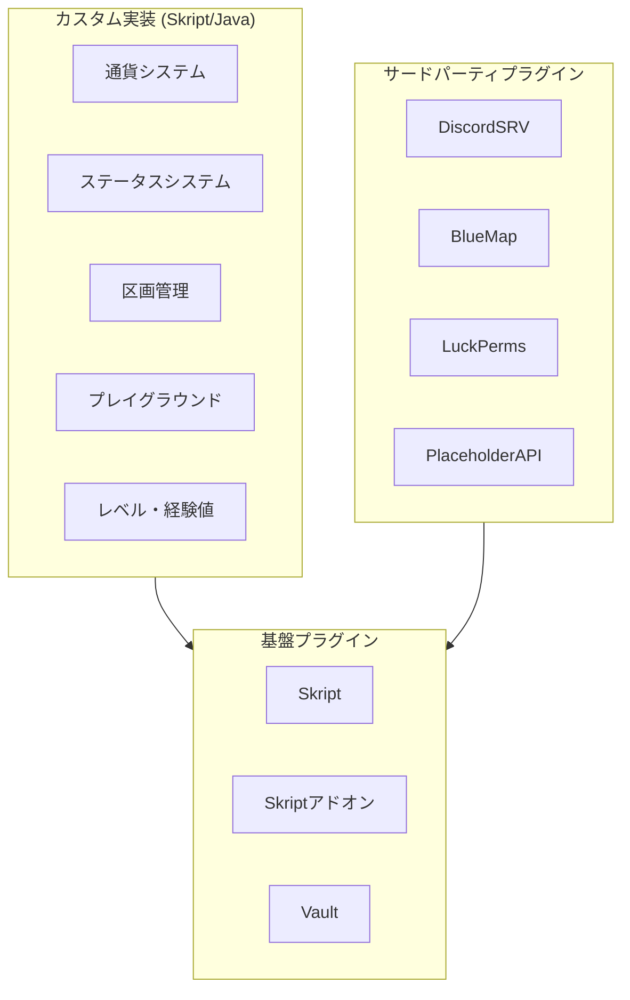
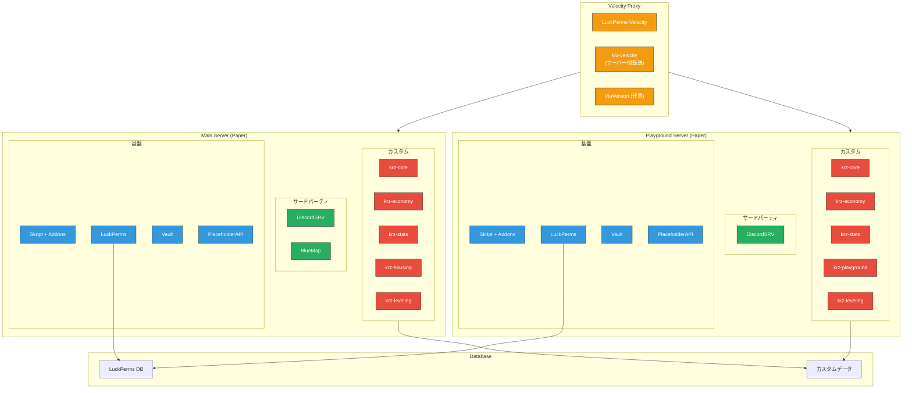
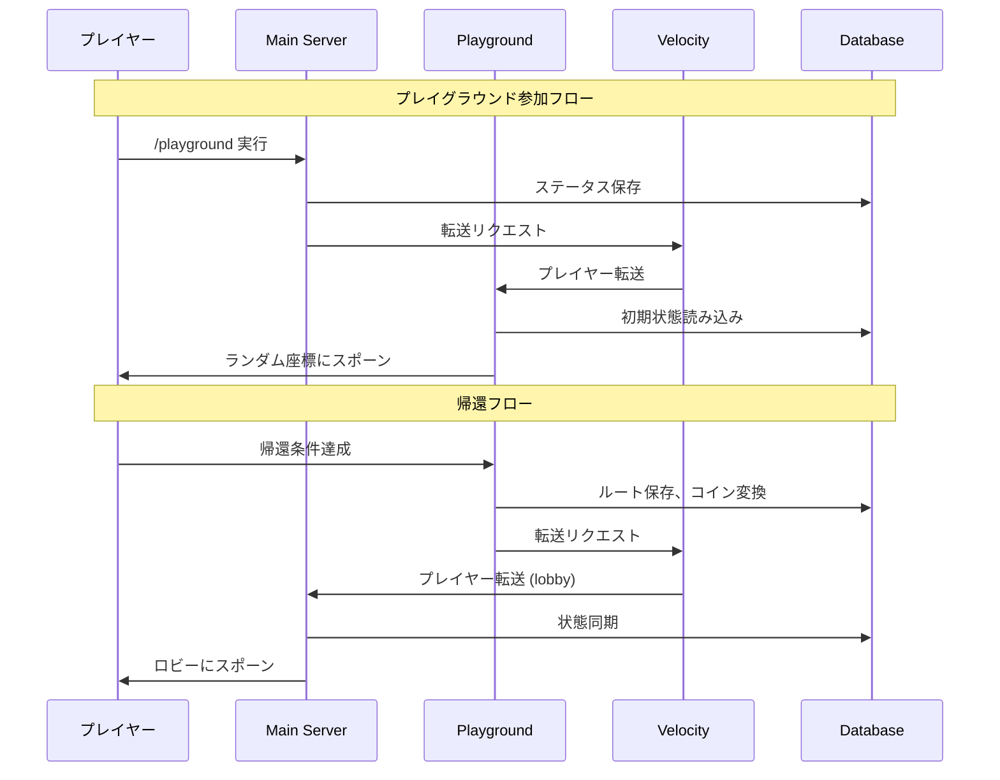
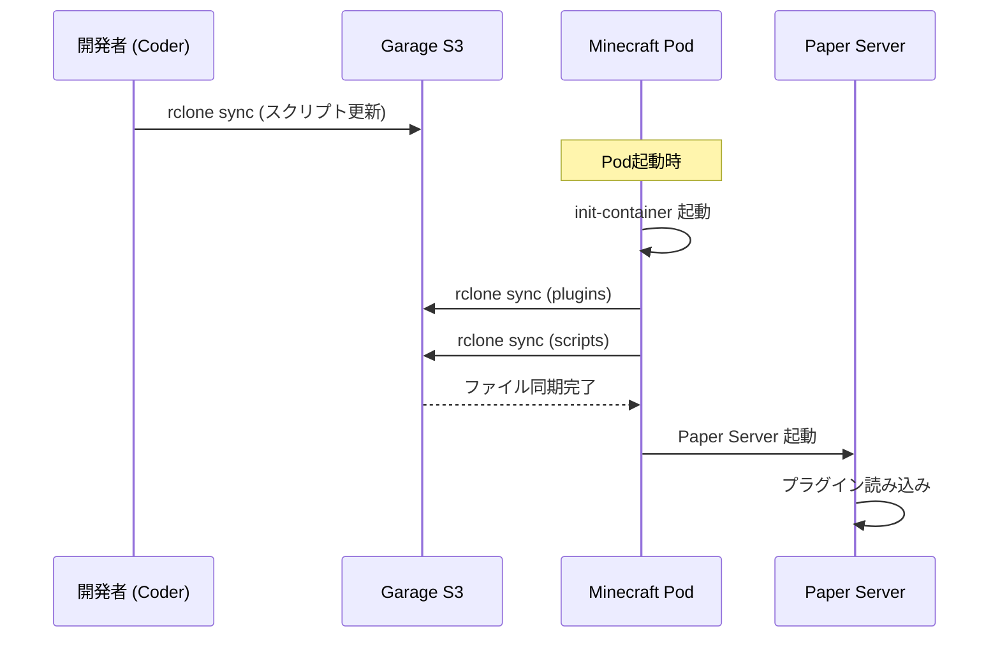

# プラグイン構成ドキュメント / Plugin Architecture

**Version:** 1.0
**Last Updated:** 2025-12-23
**Status:** Draft

---

## 1. 概要 / Overview

本ドキュメントは、各Minecraftサーバーに導入するプラグインの構成を定義します。

### 基本方針

| 分類 | 方針 |
|------|------|
| **カスタム実装** | サーバー通貨、独自ステータス、ゲームシステムはスクラッチで実装 |
| **サードパーティ** | Discord連携、Webマップなど汎用機能は既存プラグインを使用 |
| **開発言語** | 基本はSkript、パフォーマンス・複雑性に応じてJava/Kotlin |



---

## 2. サーバー別プラグイン配置 / Plugin Distribution

### 2.1 配置マトリクス

| プラグイン | Velocity | Main Server | Playground | 備考 |
|-----------|:--------:|:-----------:|:----------:|------|
| **基盤** |
| Skript | - | ✅ | ✅ | スクリプト実行環境 |
| SkBee | - | ✅ | ✅ | NBT, レシピ, 構造物 |
| skript-reflect | - | ✅ | ✅ | Java API連携 (必要時) |
| SkQuery | - | ✅ | ✅ | SQL連携 |
| PlaceholderAPI | - | ✅ | ✅ | プレースホルダー |
| ProtocolLib | - | ✅ | ✅ | パケット操作 (Private HUD用) |
| Vault | - | ✅ | ✅ | 経済・権限API |
| LuckPerms | - | ✅ | ✅ | 権限管理 |
| LuckPerms-Velocity | ✅ | - | - | Velocity用 |
| **サードパーティ** |
| DiscordSRV | - | ✅ | ✅ | Discord連携 |
| BlueMap | - | ✅ | - | Webマップ (生活ワールドのみ) |
| ViaVersion | ✅ | ✅ | ✅ | バージョン互換 (任意) |
| **カスタム** |
| krz-core | - | ✅ | ✅ | 共通ユーティリティ |
| krz-economy | - | ✅ | ✅ | 通貨システム |
| krz-stats | - | ✅ | ✅ | ステータスシステム |
| krz-housing | - | ✅ | - | 区画管理 |
| krz-playground | - | - | ✅ | プレイグラウンド |
| krz-leveling | - | ✅ | ✅ | レベル・経験値 |
| krz-velocity | ✅ | - | - | サーバー間転送 |

### 2.2 構成図



---

## 3. サードパーティプラグイン詳細 / Third-Party Plugins

### 3.1 基盤プラグイン

| プラグイン | バージョン方針 | 設定ポイント |
|-----------|---------------|-------------|
| **Skript** | 最新安定版 | Paper最適化設定有効 |
| **SkBee** | Skript互換版 | NBT, レシピ機能有効 |
| **skript-reflect** | 必要時のみ | Java API直接呼び出し |
| **SkQuery** | 最新版 | MySQL/PostgreSQL接続設定 |
| **PlaceholderAPI** | 最新版 | カスタムプレースホルダー登録 |
| **Vault** | 最新版 | krz-economy連携 |
| **LuckPerms** | 最新版 | MariaDB/PostgreSQL, Velocity連携 |

### 3.2 機能プラグイン

#### DiscordSRV

```yaml
# 主要設定項目
DiscordToken: "BOT_TOKEN"
Channels:
  global: "CHANNEL_ID"     # 全体チャット
  console: "CHANNEL_ID"    # コンソールログ
  
# サーバー別チャンネル (Main/Playground)
ServerSpecificChannels:
  main-chat: "CHANNEL_ID"
  playground-chat: "CHANNEL_ID"
```

**用途:**
- MC ↔ Discord チャット同期
- サーバー起動/停止通知
- プレイヤー参加/退出通知

#### BlueMap

```yaml
# 主要設定項目 (Main Server のみ)
webserver:
  enabled: true
  port: 8100          # 内部ポート
  
maps:
  - name: "life_world"
    world: "life_world_001"
    renderType: 3d
  - name: "lobby"
    world: "lobby"
    renderType: 2d
    
# Playground は描画しない (戦闘エリアのため)
```

**用途:**
- 生活ワールドのWeb表示
- 区画確認・案内

#### LuckPerms

```yaml
# 共通設定
storage-method: MariaDB  # or PostgreSQL
data:
  address: "db-service:3306"
  database: "luckperms"

# Velocity連携
messaging-service: sql

# グループ構成案
# default → member → vip → staff → admin
```

**用途:**
- 権限管理
- ランク表示
- サーバー間権限同期

---

## 4. カスタム実装詳細 / Custom Implementations

### 4.1 実装一覧

| モジュール | 実装言語 | 機能概要 | 優先度 |
|-----------|---------|---------|:------:|
| **krz-core** | Skript | 共通ユーティリティ、設定読み込み | 高 |
| **krz-economy** | Skript | 通貨システム、取引ログ | 高 |
| **krz-stats** | Skript | HP/防御力/攻撃力/会心率 | 高 |
| **krz-housing** | Skript | 区画購入・管理・保護 | 中 |
| **krz-playground** | Skript | 帰還システム、敵スポーン、ルート | 高 |
| **krz-leveling** | Skript | ランク/戦闘/建築/生活レベル | 中 |
| **krz-velocity** | Java | サーバー間転送、セッション管理 | 高 |

### 4.2 モジュール詳細

#### krz-core (共通基盤)

```
krz-core/
├── config.sk          # 設定読み込み
├── database.sk        # DB接続ユーティリティ
├── messages.sk        # メッセージ定義
├── utils.sk           # 共通関数
└── placeholders.sk    # PAPI連携
```

**機能:**
- 設定ファイル管理
- データベース接続プール
- 多言語対応
- プレースホルダー登録

#### krz-economy (通貨システム)

```
krz-economy/
├── economy.sk         # 残高管理 (Vault連携)
├── transactions.sk    # 取引処理
├── shop.sk            # ショップUI
└── logs.sk            # 取引ログ
```

**機能:**
- コイン残高管理
- プレイヤー間取引
- NPC/GUIショップ
- 取引履歴 (DB保存)

**Vault連携:**
```skript
# Vault経由で経済APIを提供
on vault money request:
    # krz-economyのデータを返す
```

#### krz-stats (ステータスシステム)

```
krz-stats/
├── stats.sk           # ステータス管理
├── damage.sk          # ダメージ計算
├── equipment.sk       # 装備効果適用
└── display.sk         # ActionBar/BossBar表示
```

**ステータス項目:**
| ステータス | 説明 | 初期値 |
|-----------|------|-------|
| HP | 体力 | 20 |
| DEF | 防御力 | 0 |
| ATK | 攻撃力 | 1 |
| CRIT_RATE | 会心率 | 5% |
| CRIT_DMG | 会心ダメージ | 150% |

**ダメージ計算式:**
```
実ダメージ = (ATK * 武器倍率) * (1 - DEF/100) * (会心時: CRIT_DMG)
```

#### krz-housing (区画管理)

```
krz-housing/
├── plots.sk           # 区画定義・購入
├── protection.sk      # 区画保護
├── builds.sk          # 建築レベル計測
└── neighbors.sk       # 隣接区画情報
```

**機能:**
- 区画購入 (コイン消費)
- ブロック設置/破壊保護
- 建築レベル計算 (重複排除)
- 区画情報表示

#### krz-playground (プレイグラウンド)

```
krz-playground/
├── spawn.sk           # ランダムスポーン
├── extraction.sk      # 帰還システム
├── mobs.sk            # 敵スポーン・AI
├── loot.sk            # ルートテーブル
├── death.sk           # 死亡ペナルティ
└── conversion.sk      # アイテム→コイン変換
```

**帰還条件:**
- 指定距離移動 OR 指定時間経過
- 帰還アイテム/コマンド使用

**死亡時:**
- ランク経験値減少 (ランクは維持)
- コイン・アイテム維持
- Main Server (lobby) へリスポーン

#### krz-leveling (レベルシステム)

```
krz-leveling/
├── rank.sk            # プレイヤーランク
├── combat.sk          # 戦闘レベル
├── building.sk        # 建築レベル
├── life.sk            # 生活レベル
└── daily.sk           # デイリー任務
```

**経験値獲得:**
| レベル種別 | 獲得条件 |
|-----------|---------|
| ランク | デイリー、交流、プレイ時間 |
| 戦闘 | ダメージ量、武器種、PG生存 |
| 建築 | 区画内設置/破壊 (重複排除) |
| 生活 | プレイ時間、クラフト、購入 |

#### krz-velocity (サーバー間転送)

```java
// Velocity Plugin (Java)
public class KrzVelocity {
    // サーバー間転送
    // セッション情報共有
    // 帰還時のロビー転送
}
```

**機能:**
- Playground → Main転送 (帰還完了時)
- セッションデータ引き継ぎ
- 接続状態管理

---

## 5. データフロー / Data Flow



---

## 6. 開発ロードマップ / Development Roadmap

### Phase 1: 基盤構築 (優先度: 最高)

- [ ] krz-core (設定、DB接続)
- [ ] krz-economy (通貨基本機能)
- [ ] krz-stats (ステータス基本)
- [ ] LuckPerms設定
- [ ] DiscordSRV設定

### Phase 2: ゲームシステム (優先度: 高)

- [ ] krz-playground (帰還、敵)
- [ ] krz-velocity (転送)
- [ ] krz-housing (区画購入)

### Phase 3: 拡張機能 (優先度: 中)

- [ ] krz-leveling (レベルシステム)
- [ ] BlueMap設定
- [ ] ショップUI

### Phase 4: 最適化 (優先度: 低)

- [ ] パフォーマンスチューニング
- [ ] 必要に応じてJava移植

---

## 7. ディレクトリ構成案 / Directory Structure

```
minecraft/
├── plugins/
│   ├── Skript/
│   │   └── scripts/
│   │       ├── krz-core/
│   │       ├── krz-economy/
│   │       ├── krz-stats/
│   │       ├── krz-housing/      # Main only
│   │       ├── krz-playground/   # Playground only
│   │       └── krz-leveling/
│   ├── LuckPerms/
│   ├── DiscordSRV/
│   ├── BlueMap/                  # Main only
│   ├── Vault.jar
│   ├── PlaceholderAPI.jar
│   └── ... (other jars)
└── velocity/
    └── plugins/
        ├── LuckPerms-Velocity.jar
        └── krz-velocity.jar
```

---

## 8. K8s環境でのプラグインマウント方式 / Plugin Mounting in Kubernetes

### 8.1 概要

本番Kubernetes環境では、**Garage**（S3互換オブジェクトストレージ）を使用してプラグイン・スクリプトを一元管理する。

### 8.2 マウント方式

| 種別 | 保存先 | マウント方式 | 更新方法 |
|------|--------|-------------|----------|
| **サードパーティJAR** | Garage `krz-plugins/` | init-container (rclone) | バケット更新 → Pod再起動 |
| **Skriptスクリプト** | Garage `krz-scripts/` | init-container (rclone) | バケット更新 → Pod再起動 or `/sk reload` |
| **ワールドデータ** | PersistentVolume | 直接マウント | 永続化 |
| **設定ファイル** | ConfigMap / Secret | Volume マウント | `kubectl apply` |

### 8.3 同期フロー



### 8.4 開発者コマンド

```bash
# Coder Workspace からスクリプト更新
rclone sync ./scripts/krz-economy/ garage:krz-scripts/krz-economy/

# プラグインJAR追加
rclone copy ./Skript-2.9.jar garage:krz-plugins/main/

# バケット内容確認
rclone ls garage:krz-scripts/
```

### 8.5 サーバー別バケット構造

```
krz-plugins/
├── main/              # Main Server 専用
│   ├── Skript-2.9.jar
│   ├── SkBee-3.x.jar
│   ├── BlueMap-x.x.jar
│   └── ...
├── playground/        # Playground 専用
│   ├── Skript-2.9.jar
│   └── ...
└── shared/            # 共通プラグイン
    ├── LuckPerms-5.x.jar
    ├── Vault-1.x.jar
    └── PlaceholderAPI-2.x.jar

krz-scripts/
├── krz-core/          # 共通
├── krz-economy/       # 共通
├── krz-stats/         # 共通
├── krz-housing/       # Main only
├── krz-playground/    # Playground only
└── krz-leveling/      # 共通
```

---


## Appendix: プラグインリンク

| プラグイン | リンク |
|-----------|-------|
| Skript | https://github.com/SkriptLang/Skript |
| SkBee | https://github.com/ShaneBeee/SkBee |
| skript-reflect | https://github.com/SkriptLang/skript-reflect |
| SkQuery | https://github.com/SkQuery/SkQuery |
| LuckPerms | https://luckperms.net/ |
| Vault | https://github.com/MilkBowl/Vault |
| PlaceholderAPI | https://www.spigotmc.org/resources/placeholderapi.6245/ |
| DiscordSRV | https://www.spigotmc.org/resources/discordsrv.18494/ |
| BlueMap | https://bluemap.bluecolored.de/ |

---

*Generated by Antigravity Agent - 2025-12-23*
