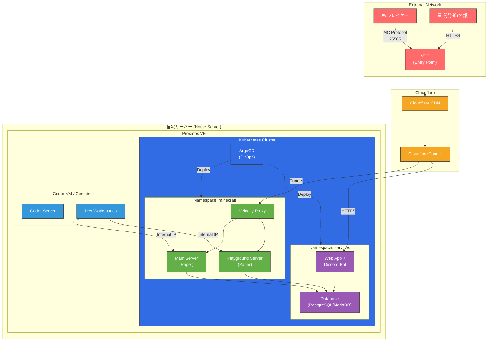
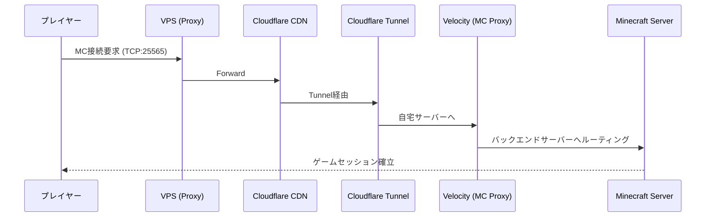
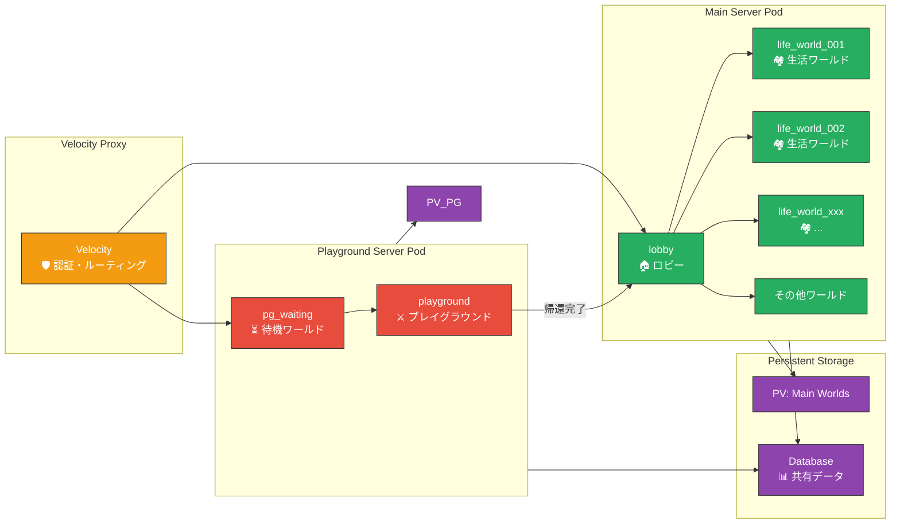
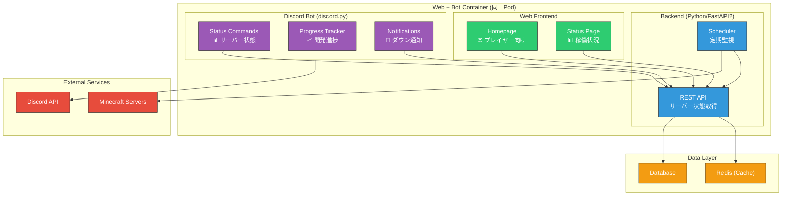
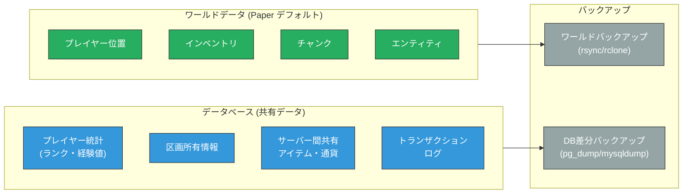
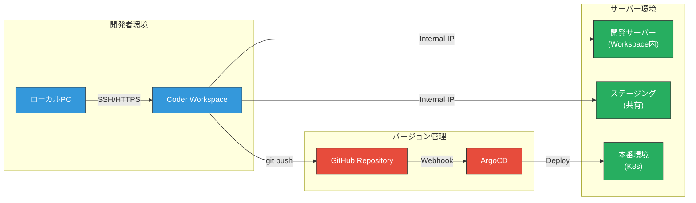
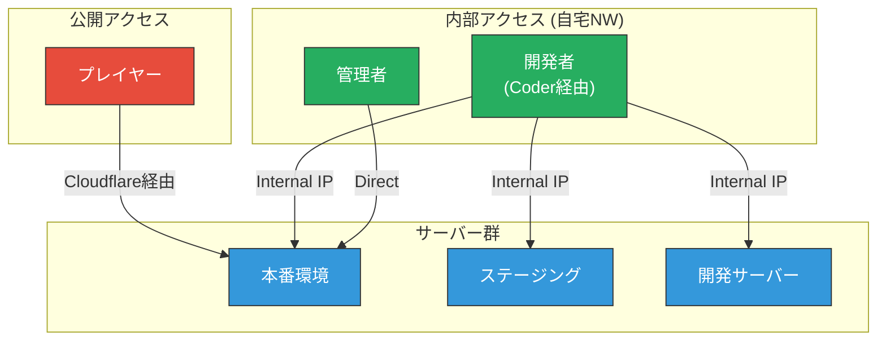

# 技術構成ドキュメント / Technical Architecture Document

**Version:** 1.0
**Last Updated:** 2025-12-23
**Status:** Draft

---

## 1. 概要 / Overview

本ドキュメントは、Krz-Tech Minecraft Server Project の技術構成を定義します。
インフラストラクチャ、ネットワーク、サービス構成、開発環境の全体像を記載しています。

---

## 2. インフラストラクチャ全体構成 / Infrastructure Overview



---

## 3. ネットワーク構成 / Network Architecture

### 3.1 外部アクセスフロー



### 3.2 アクセス経路まとめ

| 通信経路 | プロトコル | ポート | 説明 |
|---------|-----------|--------|------|
| Player → VPS | TCP | 25565 | Minecraft接続 |
| VPS → Cloudflare | TCP | 443 | CDN経由 |
| Cloudflare → Home | Tunnel | - | Cloudflare Tunnel |
| Velocity → Backend | TCP | 25565+ | 内部プロキシ |
| Web Browser → VPS | HTTPS | 443 | Webアクセス |
| Coder → MC Servers | TCP | Internal | 開発者直接アクセス |

---

## 4. Minecraft サーバー構成 / Minecraft Server Architecture

### 4.1 サーバー構成図



### 4.2 サーバー詳細

| サーバー | ソフトウェア | 役割 | ワールド |
|---------|-------------|------|----------|
| Velocity Proxy | Velocity | 認証・ルーティング・セキュリティ | - |
| Main Server | Paper | 生活・ロビー・その他 | lobby, life_world_xxx, etc. |
| Playground Server | Paper | 戦闘・Extraction | pg_waiting, playground |

> **Note:** Playgroundでは帰還処理完了後、プレイヤーはMain Server (lobby) に転送されます。

### 4.3 Playground 分離の理由

- **ログ分離**: 戦闘ログ・アイテムドロップログを独立管理
- **パフォーマンス**: 戦闘負荷をメインサーバーから隔離
- **メンテナンス**: Playground のみ再起動・更新が可能
- **シンプルな構成**: 待機ワールド + プレイグラウンドのみで完結

---

## 5. サービス構成 / Service Architecture

### 5.1 サービス構成図



### 5.2 サービス詳細

| サービス | 技術スタック | 機能 |
|---------|-------------|------|
| Web Frontend | HTML/CSS/JS (静的) | ホームページ、ステータス表示 |
| Backend API | Python (FastAPI 推奨) | サーバー状態API、DB接続 |
| Discord Bot | discord.py | 状態通知、開発進捗、コマンド |
| Database | PostgreSQL / MariaDB | 共有プレイヤーデータ |
| Cache | Redis (オプション) | 状態キャッシュ、セッション |

### 5.3 同一コンテナ構成の利点

- **内部通信**: localhost 経由で高速通信
- **デプロイ簡易化**: 単一イメージで管理
- **リソース共有**: DB接続プールの共有

---

## 6. データベース設計方針 / Database Design Principles

### 6.1 データ保存戦略



### 6.2 推奨構成

| データ種別 | 保存先 | バックアップ方式 |
|-----------|--------|-----------------|
| ワールド・チャンク | Paper デフォルト (ファイル) | 定期 rsync + 世代管理 |
| プレイヤー統計 | Database | 日次差分バックアップ |
| 区画・所有情報 | Database | トランザクションログ |
| 経済データ | Database | リアルタイムレプリケーション (将来) |

---

## 7. 開発環境 / Development Environment

### 7.1 開発フロー



### 7.2 環境一覧

| 環境 | アクセス方法 | 用途 |
|------|-------------|------|
| 開発サーバー | Coder Workspace 内スクリプト起動 | 個人開発・テスト |
| ステージング | 共有 K8s Pod (内部IPアクセス) | 統合テスト・QA |
| 本番 | K8s (ArgoCD 経由デプロイ) | プレイヤー向け |

### 7.3 アクセス制御



---

## 8. Kubernetes マニフェスト構成案 / K8s Manifest Structure

```
kubernetes/
├── base/
│   ├── namespace.yaml
│   ├── configmap.yaml
│   └── secrets.yaml (sealed)
├── minecraft/
│   ├── velocity/
│   │   ├── deployment.yaml
│   │   ├── service.yaml
│   │   └── configmap.yaml
│   ├── main-server/
│   │   ├── statefulset.yaml
│   │   ├── service.yaml
│   │   ├── pvc.yaml
│   │   └── configmap.yaml
│   └── playground/
│       ├── statefulset.yaml
│       ├── service.yaml
│       ├── pvc.yaml
│       └── configmap.yaml
├── services/
│   ├── webapp/
│   │   ├── deployment.yaml
│   │   ├── service.yaml
│   │   └── ingress.yaml
│   └── database/
│       ├── statefulset.yaml
│       ├── service.yaml
│       └── pvc.yaml
└── argocd/
    └── applications.yaml
```

---

## 9. 今後の検討事項 / Future Considerations

### 優先度: 高

- [ ] Velocity の詳細設定 (player limit, timeout, forwarding)
- [ ] Database スキーマ設計
- [ ] Cloudflare Tunnel 設定

### 優先度: 中

- [ ] Discord Bot コマンド仕様
- [ ] バックアップ自動化スクリプト
- [ ] 監視・アラート (Prometheus/Grafana)

### 優先度: 低

- [ ] ディザスタリカバリ計画

---

## Appendix: 技術選定理由

| 技術 | 選定理由 |
|------|----------|
| **Velocity** | 最新のMCプロキシ、modern forwarding対応、パフォーマンス |
| **Paper** | 安定性、プラグイン互換性、Skript対応 |
| **PostgreSQL** | 信頼性、JSON対応、差分バックアップ容易 |
| **ArgoCD** | GitOpsによる宣言的デプロイ、K8sネイティブ |
| **Cloudflare Tunnel** | ポート開放不要、DDoS対策、ゼロトラスト |

---

*Generated by Antigravity Agent - 2025-12-23*
